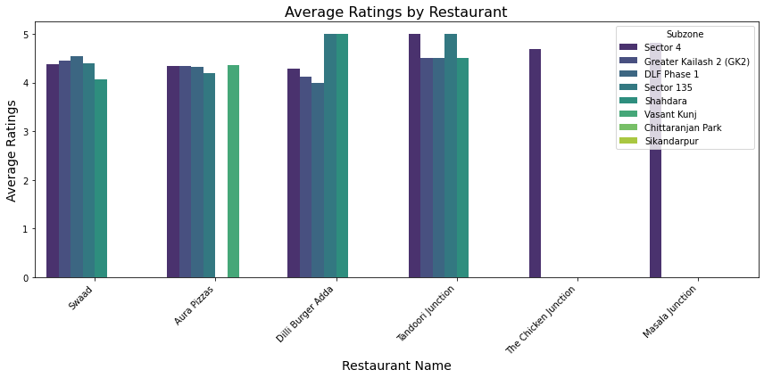
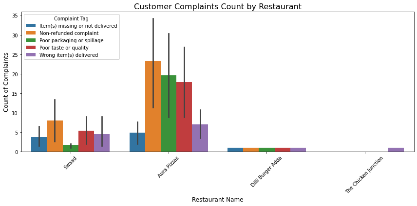
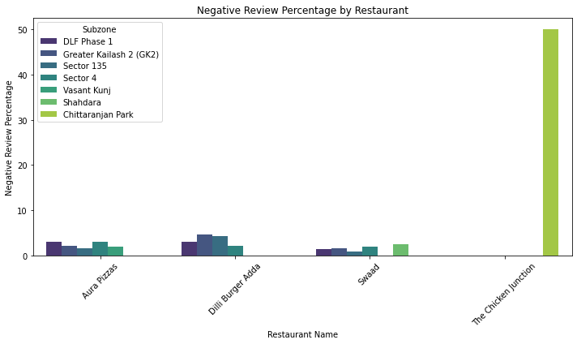

Были взяты данные с отзывами и заказами из разных ресторанов и захотелось посмотреть, как вообще рестораны справляются


```python
import pandas as pd
import matplotlib.pyplot as plt
import seaborn as sns
```


```python
data= pd.read_csv('order_history_kaggle_data.csv')
data
```


<div>
<style scoped>
    .dataframe tbody tr th:only-of-type {
        vertical-align: middle;
    }

    .dataframe tbody tr th {
        vertical-align: top;
    }

    .dataframe thead th {
        text-align: right;
    }
</style>
<table border="1" class="dataframe">
  <thead>
    <tr style="text-align: right;">
      <th></th>
      <th>Restaurant ID</th>
      <th>Restaurant name</th>
      <th>Subzone</th>
      <th>City</th>
      <th>Order ID</th>
      <th>Order Placed At</th>
      <th>Order Status</th>
      <th>Delivery</th>
      <th>Distance</th>
      <th>Items in order</th>
      <th>...</th>
      <th>Rating</th>
      <th>Review</th>
      <th>Cancellation / Rejection reason</th>
      <th>Restaurant compensation (Cancellation)</th>
      <th>Restaurant penalty (Rejection)</th>
      <th>KPT duration (minutes)</th>
      <th>Rider wait time (minutes)</th>
      <th>Order Ready Marked</th>
      <th>Customer complaint tag</th>
      <th>Customer ID</th>
    </tr>
  </thead>
  <tbody>
    <tr>
      <th>0</th>
      <td>20320607</td>
      <td>Swaad</td>
      <td>Sector 4</td>
      <td>Delhi NCR</td>
      <td>6168884918</td>
      <td>11:38 PM, September 10 2024</td>
      <td>Delivered</td>
      <td>Zomato Delivery</td>
      <td>3km</td>
      <td>1 x Grilled Chicken Jamaican Tender, 1 x Grill...</td>
      <td>...</td>
      <td>NaN</td>
      <td>NaN</td>
      <td>NaN</td>
      <td>NaN</td>
      <td>NaN</td>
      <td>18.35</td>
      <td>11.6</td>
      <td>Correctly</td>
      <td>NaN</td>
      <td>5d6c2b96db963098bc69768bea504c8bf46106a8a5178e...</td>
    </tr>
    <tr>
      <th>1</th>
      <td>20320607</td>
      <td>Swaad</td>
      <td>Sector 4</td>
      <td>Delhi NCR</td>
      <td>6170707559</td>
      <td>11:34 PM, September 10 2024</td>
      <td>Delivered</td>
      <td>Zomato Delivery</td>
      <td>2km</td>
      <td>1 x Peri Peri Fries, 1 x Fried Chicken Angara ...</td>
      <td>...</td>
      <td>NaN</td>
      <td>NaN</td>
      <td>NaN</td>
      <td>NaN</td>
      <td>NaN</td>
      <td>16.95</td>
      <td>3.6</td>
      <td>Correctly</td>
      <td>NaN</td>
      <td>0781815deb4a10a574e9fee4fa0b86b074d4a0b36175d5...</td>
    </tr>
    <tr>
      <th>2</th>
      <td>20320607</td>
      <td>Swaad</td>
      <td>Sector 4</td>
      <td>Delhi NCR</td>
      <td>6169375019</td>
      <td>03:52 PM, September 10 2024</td>
      <td>Delivered</td>
      <td>Zomato Delivery</td>
      <td>&lt;1km</td>
      <td>1 x Bone in Peri Peri Grilled Chicken</td>
      <td>...</td>
      <td>NaN</td>
      <td>NaN</td>
      <td>NaN</td>
      <td>NaN</td>
      <td>NaN</td>
      <td>14.05</td>
      <td>12.2</td>
      <td>Correctly</td>
      <td>NaN</td>
      <td>f93362f5ce5382657482d164e368186bcec9c6225fd93d...</td>
    </tr>
    <tr>
      <th>3</th>
      <td>20320607</td>
      <td>Swaad</td>
      <td>Sector 4</td>
      <td>Delhi NCR</td>
      <td>6151677434</td>
      <td>03:45 PM, September 10 2024</td>
      <td>Delivered</td>
      <td>Zomato Delivery</td>
      <td>2km</td>
      <td>1 x Fried Chicken Ghostbuster Tender, 1 x Anga...</td>
      <td>...</td>
      <td>4.0</td>
      <td>NaN</td>
      <td>NaN</td>
      <td>NaN</td>
      <td>NaN</td>
      <td>19.00</td>
      <td>3.3</td>
      <td>Correctly</td>
      <td>NaN</td>
      <td>1ed226d1b8a5f7acee12fc1d6676558330a3b2b742af5d...</td>
    </tr>
    <tr>
      <th>4</th>
      <td>20320607</td>
      <td>Swaad</td>
      <td>Sector 4</td>
      <td>Delhi NCR</td>
      <td>6167540897</td>
      <td>03:04 PM, September 10 2024</td>
      <td>Delivered</td>
      <td>Zomato Delivery</td>
      <td>2km</td>
      <td>1 x Peri Peri Krispers, 1 x Fried Chicken Anga...</td>
      <td>...</td>
      <td>NaN</td>
      <td>NaN</td>
      <td>NaN</td>
      <td>NaN</td>
      <td>NaN</td>
      <td>15.97</td>
      <td>1.0</td>
      <td>Correctly</td>
      <td>NaN</td>
      <td>d21a2ac6ea06b31cc3288ab20c4ef2f292066c096f2c5f...</td>
    </tr>
    <tr>
      <th>...</th>
      <td>...</td>
      <td>...</td>
      <td>...</td>
      <td>...</td>
      <td>...</td>
      <td>...</td>
      <td>...</td>
      <td>...</td>
      <td>...</td>
      <td>...</td>
      <td>...</td>
      <td>...</td>
      <td>...</td>
      <td>...</td>
      <td>...</td>
      <td>...</td>
      <td>...</td>
      <td>...</td>
      <td>...</td>
      <td>...</td>
      <td>...</td>
    </tr>
    <tr>
      <th>21316</th>
      <td>21467440</td>
      <td>The Chicken Junction</td>
      <td>Chittaranjan Park</td>
      <td>Delhi NCR</td>
      <td>6568490993</td>
      <td>03:26 AM, January 30 2025</td>
      <td>Delivered</td>
      <td>Zomato Delivery</td>
      <td>5km</td>
      <td>1 x Fried Chicken Desi Peri Peri Bites (Bone)</td>
      <td>...</td>
      <td>NaN</td>
      <td>NaN</td>
      <td>NaN</td>
      <td>NaN</td>
      <td>NaN</td>
      <td>14.32</td>
      <td>9.0</td>
      <td>Correctly</td>
      <td>Wrong item(s) delivered</td>
      <td>c6ee80eb35f2ef1630fd93ea88f8c0ac27eff57229a6d5...</td>
    </tr>
    <tr>
      <th>21317</th>
      <td>21467440</td>
      <td>The Chicken Junction</td>
      <td>Chittaranjan Park</td>
      <td>Delhi NCR</td>
      <td>6564842673</td>
      <td>02:44 AM, January 29 2025</td>
      <td>Delivered</td>
      <td>Zomato Delivery</td>
      <td>5km</td>
      <td>1 x Fried Chicken 65 Masala Boneless Bites</td>
      <td>...</td>
      <td>NaN</td>
      <td>NaN</td>
      <td>NaN</td>
      <td>NaN</td>
      <td>NaN</td>
      <td>NaN</td>
      <td>10.8</td>
      <td>Missed</td>
      <td>NaN</td>
      <td>d2a0153ba6512894c1bebe974f6898ba10df50abc2c954...</td>
    </tr>
    <tr>
      <th>21318</th>
      <td>21523055</td>
      <td>Masala Junction</td>
      <td>Sector 4</td>
      <td>Delhi NCR</td>
      <td>6553527557</td>
      <td>10:05 PM, January 24 2025</td>
      <td>Delivered</td>
      <td>Zomato Delivery</td>
      <td>8km</td>
      <td>1 x Korean Fried Chicken Slider</td>
      <td>...</td>
      <td>5.0</td>
      <td>Yummy food! Delicious food! Lip smacking food!...</td>
      <td>NaN</td>
      <td>NaN</td>
      <td>NaN</td>
      <td>16.27</td>
      <td>9.4</td>
      <td>Incorrectly</td>
      <td>NaN</td>
      <td>0b6168cbaf96aa5a0ae6b46d19d83ec9cad0d9508d43d7...</td>
    </tr>
    <tr>
      <th>21319</th>
      <td>21523055</td>
      <td>Masala Junction</td>
      <td>Sector 4</td>
      <td>Delhi NCR</td>
      <td>6541170157</td>
      <td>02:27 PM, January 21 2025</td>
      <td>Delivered</td>
      <td>Zomato Delivery</td>
      <td>9km</td>
      <td>1 x Ooh Saucy Fries</td>
      <td>...</td>
      <td>4.0</td>
      <td>The peri peri fries were truly so tasty and de...</td>
      <td>NaN</td>
      <td>NaN</td>
      <td>NaN</td>
      <td>12.77</td>
      <td>1.3</td>
      <td>Correctly</td>
      <td>NaN</td>
      <td>410b3e056e511e3423d9497c629ca897f91cace2a2a732...</td>
    </tr>
    <tr>
      <th>21320</th>
      <td>21523055</td>
      <td>Masala Junction</td>
      <td>Sector 4</td>
      <td>Delhi NCR</td>
      <td>6543973010</td>
      <td>02:55 AM, January 21 2025</td>
      <td>Delivered</td>
      <td>Zomato Delivery</td>
      <td>3km</td>
      <td>1 x Grilled Chicken Jamaican Slider</td>
      <td>...</td>
      <td>NaN</td>
      <td>NaN</td>
      <td>NaN</td>
      <td>NaN</td>
      <td>NaN</td>
      <td>16.52</td>
      <td>8.7</td>
      <td>Correctly</td>
      <td>NaN</td>
      <td>1f885b307de98a52c7b6f75a8813cc130e3049ad0be017...</td>
    </tr>
  </tbody>
</table>
<p>21321 rows × 29 columns</p>
</div>


```python
#средний рейтинг по каждому ресторану+зоне
mean_rating=data.groupby(['Restaurant ID', 'Restaurant name', 'Subzone'], as_index=False).agg(ratings=('Rating', 'mean'))
mean_rating
```


<div>
<style scoped>
    .dataframe tbody tr th:only-of-type {
        vertical-align: middle;
    }

    .dataframe tbody tr th {
        vertical-align: top;
    }

    .dataframe thead th {
        text-align: right;
    }
</style>
<table border="1" class="dataframe">
  <thead>
    <tr style="text-align: right;">
      <th></th>
      <th>Restaurant ID</th>
      <th>Restaurant name</th>
      <th>Subzone</th>
      <th>ratings</th>
    </tr>
  </thead>
  <tbody>
    <tr>
      <th>0</th>
      <td>20320607</td>
      <td>Swaad</td>
      <td>Sector 4</td>
      <td>4.378238</td>
    </tr>
    <tr>
      <th>1</th>
      <td>20554001</td>
      <td>Swaad</td>
      <td>Greater Kailash 2 (GK2)</td>
      <td>4.447458</td>
    </tr>
    <tr>
      <th>2</th>
      <td>20635699</td>
      <td>Aura Pizzas</td>
      <td>Greater Kailash 2 (GK2)</td>
      <td>4.340187</td>
    </tr>
    <tr>
      <th>3</th>
      <td>20659868</td>
      <td>Aura Pizzas</td>
      <td>Sector 4</td>
      <td>4.332721</td>
    </tr>
    <tr>
      <th>4</th>
      <td>20882652</td>
      <td>Aura Pizzas</td>
      <td>DLF Phase 1</td>
      <td>4.329787</td>
    </tr>
    <tr>
      <th>5</th>
      <td>20882713</td>
      <td>Swaad</td>
      <td>DLF Phase 1</td>
      <td>4.535433</td>
    </tr>
    <tr>
      <th>6</th>
      <td>20968171</td>
      <td>Dilli Burger Adda</td>
      <td>DLF Phase 1</td>
      <td>4.000000</td>
    </tr>
    <tr>
      <th>7</th>
      <td>20968194</td>
      <td>Dilli Burger Adda</td>
      <td>Sector 4</td>
      <td>4.285714</td>
    </tr>
    <tr>
      <th>8</th>
      <td>20968206</td>
      <td>Dilli Burger Adda</td>
      <td>Greater Kailash 2 (GK2)</td>
      <td>4.120000</td>
    </tr>
    <tr>
      <th>9</th>
      <td>21077127</td>
      <td>Aura Pizzas</td>
      <td>Sector 135</td>
      <td>4.195455</td>
    </tr>
    <tr>
      <th>10</th>
      <td>21114574</td>
      <td>Dilli Burger Adda</td>
      <td>Sector 135</td>
      <td>5.000000</td>
    </tr>
    <tr>
      <th>11</th>
      <td>21114574</td>
      <td>Dilli Burger Adda</td>
      <td>Shahdara</td>
      <td>5.000000</td>
    </tr>
    <tr>
      <th>12</th>
      <td>21143186</td>
      <td>Tandoori Junction</td>
      <td>Greater Kailash 2 (GK2)</td>
      <td>4.500000</td>
    </tr>
    <tr>
      <th>13</th>
      <td>21145152</td>
      <td>Tandoori Junction</td>
      <td>Sector 4</td>
      <td>5.000000</td>
    </tr>
    <tr>
      <th>14</th>
      <td>21173951</td>
      <td>Aura Pizzas</td>
      <td>Vasant Kunj</td>
      <td>4.353448</td>
    </tr>
    <tr>
      <th>15</th>
      <td>21309083</td>
      <td>Swaad</td>
      <td>Sector 135</td>
      <td>4.394737</td>
    </tr>
    <tr>
      <th>16</th>
      <td>21309083</td>
      <td>Swaad</td>
      <td>Shahdara</td>
      <td>4.068966</td>
    </tr>
    <tr>
      <th>17</th>
      <td>21350931</td>
      <td>Tandoori Junction</td>
      <td>DLF Phase 1</td>
      <td>4.500000</td>
    </tr>
    <tr>
      <th>18</th>
      <td>21424296</td>
      <td>Tandoori Junction</td>
      <td>Sector 135</td>
      <td>5.000000</td>
    </tr>
    <tr>
      <th>19</th>
      <td>21424296</td>
      <td>Tandoori Junction</td>
      <td>Shahdara</td>
      <td>4.500000</td>
    </tr>
    <tr>
      <th>20</th>
      <td>21467269</td>
      <td>The Chicken Junction</td>
      <td>Sector 4</td>
      <td>4.692308</td>
    </tr>
    <tr>
      <th>21</th>
      <td>21467440</td>
      <td>The Chicken Junction</td>
      <td>Chittaranjan Park</td>
      <td>NaN</td>
    </tr>
    <tr>
      <th>22</th>
      <td>21467512</td>
      <td>The Chicken Junction</td>
      <td>Sikandarpur</td>
      <td>NaN</td>
    </tr>
    <tr>
      <th>23</th>
      <td>21523055</td>
      <td>Masala Junction</td>
      <td>Sector 4</td>
      <td>4.826087</td>
    </tr>
  </tbody>
</table>
</div>


```python
plt.figure(figsize=(12, 6))
sns.barplot(data=mean_rating, x='Restaurant name', y='ratings', hue='Subzone', palette='viridis')

plt.title('Average Ratings by Restaurant', fontsize=16)
plt.xlabel('Restaurant Name', fontsize=14)
plt.ylabel('Average Ratings', fontsize=14)
plt.xticks(rotation=45, ha='right')  

plt.legend(title='Subzone')
plt.tight_layout()  
plt.show()
```





```python
#виды жалоб
data['Customer complaint tag'].unique().tolist()
```


    [nan,
     'Poor taste or quality',
     'Non-refunded complaint',
     'Poor packaging or spillage',
     'Item(s) missing or not delivered',
     'Wrong item(s) delivered']


```python
#виды жалоб по ресторанам+их количество
a=data.groupby(['Restaurant ID', 'Restaurant name', 'Subzone','Customer complaint tag' ], as_index=False).agg(count_reason=('Customer complaint tag', 'count'))
sum_negativ=a.groupby(['Restaurant name','Subzone' ], as_index=False).agg(summ=('count_reason', 'sum'))
```


```python
plt.figure(figsize=(12, 6))
bar_plot = sns.barplot(data=a, x='Restaurant name', y='count_reason', hue='Customer complaint tag')

plt.title('Customer Complaints Count by Restaurant', fontsize=16)
plt.xlabel('Restaurant Name', fontsize=12)
plt.ylabel('Count of Complaints', fontsize=12)
plt.xticks(rotation=45)
plt.legend(title='Complaint Tag')
plt.tight_layout()

plt.show()
```





```python
#средний рейтинг по каждой зоне
data.groupby(['Restaurant ID', 'Subzone'], as_index=False).agg(ratings=('Rating', 'mean'))
```


<div>
<style scoped>
    .dataframe tbody tr th:only-of-type {
        vertical-align: middle;
    }

    .dataframe tbody tr th {
        vertical-align: top;
    }

    .dataframe thead th {
        text-align: right;
    }
</style>
<table border="1" class="dataframe">
  <thead>
    <tr style="text-align: right;">
      <th></th>
      <th>Restaurant ID</th>
      <th>Subzone</th>
      <th>ratings</th>
    </tr>
  </thead>
  <tbody>
    <tr>
      <th>0</th>
      <td>20320607</td>
      <td>Sector 4</td>
      <td>4.378238</td>
    </tr>
    <tr>
      <th>1</th>
      <td>20554001</td>
      <td>Greater Kailash 2 (GK2)</td>
      <td>4.447458</td>
    </tr>
    <tr>
      <th>2</th>
      <td>20635699</td>
      <td>Greater Kailash 2 (GK2)</td>
      <td>4.340187</td>
    </tr>
    <tr>
      <th>3</th>
      <td>20659868</td>
      <td>Sector 4</td>
      <td>4.332721</td>
    </tr>
    <tr>
      <th>4</th>
      <td>20882652</td>
      <td>DLF Phase 1</td>
      <td>4.329787</td>
    </tr>
    <tr>
      <th>5</th>
      <td>20882713</td>
      <td>DLF Phase 1</td>
      <td>4.535433</td>
    </tr>
    <tr>
      <th>6</th>
      <td>20968171</td>
      <td>DLF Phase 1</td>
      <td>4.000000</td>
    </tr>
    <tr>
      <th>7</th>
      <td>20968194</td>
      <td>Sector 4</td>
      <td>4.285714</td>
    </tr>
    <tr>
      <th>8</th>
      <td>20968206</td>
      <td>Greater Kailash 2 (GK2)</td>
      <td>4.120000</td>
    </tr>
    <tr>
      <th>9</th>
      <td>21077127</td>
      <td>Sector 135</td>
      <td>4.195455</td>
    </tr>
    <tr>
      <th>10</th>
      <td>21114574</td>
      <td>Sector 135</td>
      <td>5.000000</td>
    </tr>
    <tr>
      <th>11</th>
      <td>21114574</td>
      <td>Shahdara</td>
      <td>5.000000</td>
    </tr>
    <tr>
      <th>12</th>
      <td>21143186</td>
      <td>Greater Kailash 2 (GK2)</td>
      <td>4.500000</td>
    </tr>
    <tr>
      <th>13</th>
      <td>21145152</td>
      <td>Sector 4</td>
      <td>5.000000</td>
    </tr>
    <tr>
      <th>14</th>
      <td>21173951</td>
      <td>Vasant Kunj</td>
      <td>4.353448</td>
    </tr>
    <tr>
      <th>15</th>
      <td>21309083</td>
      <td>Sector 135</td>
      <td>4.394737</td>
    </tr>
    <tr>
      <th>16</th>
      <td>21309083</td>
      <td>Shahdara</td>
      <td>4.068966</td>
    </tr>
    <tr>
      <th>17</th>
      <td>21350931</td>
      <td>DLF Phase 1</td>
      <td>4.500000</td>
    </tr>
    <tr>
      <th>18</th>
      <td>21424296</td>
      <td>Sector 135</td>
      <td>5.000000</td>
    </tr>
    <tr>
      <th>19</th>
      <td>21424296</td>
      <td>Shahdara</td>
      <td>4.500000</td>
    </tr>
    <tr>
      <th>20</th>
      <td>21467269</td>
      <td>Sector 4</td>
      <td>4.692308</td>
    </tr>
    <tr>
      <th>21</th>
      <td>21467440</td>
      <td>Chittaranjan Park</td>
      <td>NaN</td>
    </tr>
    <tr>
      <th>22</th>
      <td>21467512</td>
      <td>Sikandarpur</td>
      <td>NaN</td>
    </tr>
    <tr>
      <th>23</th>
      <td>21523055</td>
      <td>Sector 4</td>
      <td>4.826087</td>
    </tr>
  </tbody>
</table>
</div>


ну вот мы все вот это проанализировала просто собрали.
но чисто по-человечески, кажется, что где-то здесь закралась лажа. 
Внимание, теория! кажется, что вот есть хорошие и ррестораны и рестораны где есть много косяков. а может быть, просто посмотрим на соотношение негативных отзывов и заказов?


```python
delivered=data[data['Order Status']=='Delivered']
```


```python
delivere_count=delivered.groupby(['Restaurant name', 'Subzone'], as_index=False).agg(count=('Order ID', 'nunique'))
delivere_count
```


<div>
<style scoped>
    .dataframe tbody tr th:only-of-type {
        vertical-align: middle;
    }

    .dataframe tbody tr th {
        vertical-align: top;
    }

    .dataframe thead th {
        text-align: right;
    }
</style>
<table border="1" class="dataframe">
  <thead>
    <tr style="text-align: right;">
      <th></th>
      <th>Restaurant name</th>
      <th>Subzone</th>
      <th>count</th>
    </tr>
  </thead>
  <tbody>
    <tr>
      <th>0</th>
      <td>Aura Pizzas</td>
      <td>DLF Phase 1</td>
      <td>2523</td>
    </tr>
    <tr>
      <th>1</th>
      <td>Aura Pizzas</td>
      <td>Greater Kailash 2 (GK2)</td>
      <td>4369</td>
    </tr>
    <tr>
      <th>2</th>
      <td>Aura Pizzas</td>
      <td>Sector 135</td>
      <td>2035</td>
    </tr>
    <tr>
      <th>3</th>
      <td>Aura Pizzas</td>
      <td>Sector 4</td>
      <td>4574</td>
    </tr>
    <tr>
      <th>4</th>
      <td>Aura Pizzas</td>
      <td>Vasant Kunj</td>
      <td>916</td>
    </tr>
    <tr>
      <th>5</th>
      <td>Dilli Burger Adda</td>
      <td>DLF Phase 1</td>
      <td>33</td>
    </tr>
    <tr>
      <th>6</th>
      <td>Dilli Burger Adda</td>
      <td>Greater Kailash 2 (GK2)</td>
      <td>106</td>
    </tr>
    <tr>
      <th>7</th>
      <td>Dilli Burger Adda</td>
      <td>Sector 135</td>
      <td>23</td>
    </tr>
    <tr>
      <th>8</th>
      <td>Dilli Burger Adda</td>
      <td>Sector 4</td>
      <td>47</td>
    </tr>
    <tr>
      <th>9</th>
      <td>Dilli Burger Adda</td>
      <td>Shahdara</td>
      <td>14</td>
    </tr>
    <tr>
      <th>10</th>
      <td>Masala Junction</td>
      <td>Sector 4</td>
      <td>26</td>
    </tr>
    <tr>
      <th>11</th>
      <td>Swaad</td>
      <td>DLF Phase 1</td>
      <td>1070</td>
    </tr>
    <tr>
      <th>12</th>
      <td>Swaad</td>
      <td>Greater Kailash 2 (GK2)</td>
      <td>2765</td>
    </tr>
    <tr>
      <th>13</th>
      <td>Swaad</td>
      <td>Sector 135</td>
      <td>367</td>
    </tr>
    <tr>
      <th>14</th>
      <td>Swaad</td>
      <td>Sector 4</td>
      <td>1750</td>
    </tr>
    <tr>
      <th>15</th>
      <td>Swaad</td>
      <td>Shahdara</td>
      <td>330</td>
    </tr>
    <tr>
      <th>16</th>
      <td>Tandoori Junction</td>
      <td>DLF Phase 1</td>
      <td>27</td>
    </tr>
    <tr>
      <th>17</th>
      <td>Tandoori Junction</td>
      <td>Greater Kailash 2 (GK2)</td>
      <td>71</td>
    </tr>
    <tr>
      <th>18</th>
      <td>Tandoori Junction</td>
      <td>Sector 135</td>
      <td>1</td>
    </tr>
    <tr>
      <th>19</th>
      <td>Tandoori Junction</td>
      <td>Sector 4</td>
      <td>37</td>
    </tr>
    <tr>
      <th>20</th>
      <td>Tandoori Junction</td>
      <td>Shahdara</td>
      <td>15</td>
    </tr>
    <tr>
      <th>21</th>
      <td>The Chicken Junction</td>
      <td>Chittaranjan Park</td>
      <td>2</td>
    </tr>
    <tr>
      <th>22</th>
      <td>The Chicken Junction</td>
      <td>Sector 4</td>
      <td>29</td>
    </tr>
    <tr>
      <th>23</th>
      <td>The Chicken Junction</td>
      <td>Sikandarpur</td>
      <td>1</td>
    </tr>
  </tbody>
</table>
</div>


опляяяяяяяя вот мы и узнали почему у них так мало жалоб и всякого такого, щас мы посчитаем процентик 


```python
percent=pd.merge(sum_negativ,delivere_count, on=['Restaurant name', 'Subzone'],how='inner' )
percent
```


<div>
<style scoped>
    .dataframe tbody tr th:only-of-type {
        vertical-align: middle;
    }

    .dataframe tbody tr th {
        vertical-align: top;
    }

    .dataframe thead th {
        text-align: right;
    }
</style>
<table border="1" class="dataframe">
  <thead>
    <tr style="text-align: right;">
      <th></th>
      <th>Restaurant name</th>
      <th>Subzone</th>
      <th>summ</th>
      <th>count</th>
    </tr>
  </thead>
  <tbody>
    <tr>
      <th>0</th>
      <td>Aura Pizzas</td>
      <td>DLF Phase 1</td>
      <td>78</td>
      <td>2523</td>
    </tr>
    <tr>
      <th>1</th>
      <td>Aura Pizzas</td>
      <td>Greater Kailash 2 (GK2)</td>
      <td>91</td>
      <td>4369</td>
    </tr>
    <tr>
      <th>2</th>
      <td>Aura Pizzas</td>
      <td>Sector 135</td>
      <td>33</td>
      <td>2035</td>
    </tr>
    <tr>
      <th>3</th>
      <td>Aura Pizzas</td>
      <td>Sector 4</td>
      <td>135</td>
      <td>4574</td>
    </tr>
    <tr>
      <th>4</th>
      <td>Aura Pizzas</td>
      <td>Vasant Kunj</td>
      <td>18</td>
      <td>916</td>
    </tr>
    <tr>
      <th>5</th>
      <td>Dilli Burger Adda</td>
      <td>DLF Phase 1</td>
      <td>1</td>
      <td>33</td>
    </tr>
    <tr>
      <th>6</th>
      <td>Dilli Burger Adda</td>
      <td>Greater Kailash 2 (GK2)</td>
      <td>5</td>
      <td>106</td>
    </tr>
    <tr>
      <th>7</th>
      <td>Dilli Burger Adda</td>
      <td>Sector 135</td>
      <td>1</td>
      <td>23</td>
    </tr>
    <tr>
      <th>8</th>
      <td>Dilli Burger Adda</td>
      <td>Sector 4</td>
      <td>1</td>
      <td>47</td>
    </tr>
    <tr>
      <th>9</th>
      <td>Swaad</td>
      <td>DLF Phase 1</td>
      <td>15</td>
      <td>1070</td>
    </tr>
    <tr>
      <th>10</th>
      <td>Swaad</td>
      <td>Greater Kailash 2 (GK2)</td>
      <td>46</td>
      <td>2765</td>
    </tr>
    <tr>
      <th>11</th>
      <td>Swaad</td>
      <td>Sector 135</td>
      <td>3</td>
      <td>367</td>
    </tr>
    <tr>
      <th>12</th>
      <td>Swaad</td>
      <td>Sector 4</td>
      <td>33</td>
      <td>1750</td>
    </tr>
    <tr>
      <th>13</th>
      <td>Swaad</td>
      <td>Shahdara</td>
      <td>8</td>
      <td>330</td>
    </tr>
    <tr>
      <th>14</th>
      <td>The Chicken Junction</td>
      <td>Chittaranjan Park</td>
      <td>1</td>
      <td>2</td>
    </tr>
  </tbody>
</table>
</div>


```python
percent['Negative Review Percentage'] = (percent['summ'] / percent['count']) * 100
percent.sort_values(by='Negative Review Percentage')
```


<div>
<style scoped>
    .dataframe tbody tr th:only-of-type {
        vertical-align: middle;
    }

    .dataframe tbody tr th {
        vertical-align: top;
    }

    .dataframe thead th {
        text-align: right;
    }
</style>
<table border="1" class="dataframe">
  <thead>
    <tr style="text-align: right;">
      <th></th>
      <th>Restaurant name</th>
      <th>Subzone</th>
      <th>summ</th>
      <th>count</th>
      <th>Negative Review Percentage</th>
    </tr>
  </thead>
  <tbody>
    <tr>
      <th>11</th>
      <td>Swaad</td>
      <td>Sector 135</td>
      <td>3</td>
      <td>367</td>
      <td>0.817439</td>
    </tr>
    <tr>
      <th>9</th>
      <td>Swaad</td>
      <td>DLF Phase 1</td>
      <td>15</td>
      <td>1070</td>
      <td>1.401869</td>
    </tr>
    <tr>
      <th>2</th>
      <td>Aura Pizzas</td>
      <td>Sector 135</td>
      <td>33</td>
      <td>2035</td>
      <td>1.621622</td>
    </tr>
    <tr>
      <th>10</th>
      <td>Swaad</td>
      <td>Greater Kailash 2 (GK2)</td>
      <td>46</td>
      <td>2765</td>
      <td>1.663653</td>
    </tr>
    <tr>
      <th>12</th>
      <td>Swaad</td>
      <td>Sector 4</td>
      <td>33</td>
      <td>1750</td>
      <td>1.885714</td>
    </tr>
    <tr>
      <th>4</th>
      <td>Aura Pizzas</td>
      <td>Vasant Kunj</td>
      <td>18</td>
      <td>916</td>
      <td>1.965066</td>
    </tr>
    <tr>
      <th>1</th>
      <td>Aura Pizzas</td>
      <td>Greater Kailash 2 (GK2)</td>
      <td>91</td>
      <td>4369</td>
      <td>2.082856</td>
    </tr>
    <tr>
      <th>8</th>
      <td>Dilli Burger Adda</td>
      <td>Sector 4</td>
      <td>1</td>
      <td>47</td>
      <td>2.127660</td>
    </tr>
    <tr>
      <th>13</th>
      <td>Swaad</td>
      <td>Shahdara</td>
      <td>8</td>
      <td>330</td>
      <td>2.424242</td>
    </tr>
    <tr>
      <th>3</th>
      <td>Aura Pizzas</td>
      <td>Sector 4</td>
      <td>135</td>
      <td>4574</td>
      <td>2.951465</td>
    </tr>
    <tr>
      <th>5</th>
      <td>Dilli Burger Adda</td>
      <td>DLF Phase 1</td>
      <td>1</td>
      <td>33</td>
      <td>3.030303</td>
    </tr>
    <tr>
      <th>0</th>
      <td>Aura Pizzas</td>
      <td>DLF Phase 1</td>
      <td>78</td>
      <td>2523</td>
      <td>3.091558</td>
    </tr>
    <tr>
      <th>7</th>
      <td>Dilli Burger Adda</td>
      <td>Sector 135</td>
      <td>1</td>
      <td>23</td>
      <td>4.347826</td>
    </tr>
    <tr>
      <th>6</th>
      <td>Dilli Burger Adda</td>
      <td>Greater Kailash 2 (GK2)</td>
      <td>5</td>
      <td>106</td>
      <td>4.716981</td>
    </tr>
    <tr>
      <th>14</th>
      <td>The Chicken Junction</td>
      <td>Chittaranjan Park</td>
      <td>1</td>
      <td>2</td>
      <td>50.000000</td>
    </tr>
  </tbody>
</table>
</div>


блин ну какой тут лютый вайб, конечно, вау
но выводы будут в конце, никаких спойлеров :)


```python
plt.figure(figsize=(10, 6))
sns.barplot(data=percent, x='Restaurant name', y='Negative Review Percentage', hue='Subzone', palette='viridis')

# Подписи и заголовок
plt.xlabel('Restaurant Name')
plt.ylabel('Negative Review Percentage')
plt.title('Negative Review Percentage by Restaurant')
plt.xticks(rotation=45)
plt.legend(title='Subzone')
plt.tight_layout()  # Уплотнение элементов графика
plt.show()
```





выводы: 
1. The Chicken Junction	- очень плохой ресторан, на два заказа, один с жалобой
2. Остальные вроде неплохие! но в разных районах нужно будет получше следить для разных ресторанов:Swaad - Shahdara, Aura Pizzas - везде понемногу, но особенно DLF Phase 1	, Dilli Burger Adda	 - Greater Kailash 2 (GK2)
3. вот такая вот молодец
